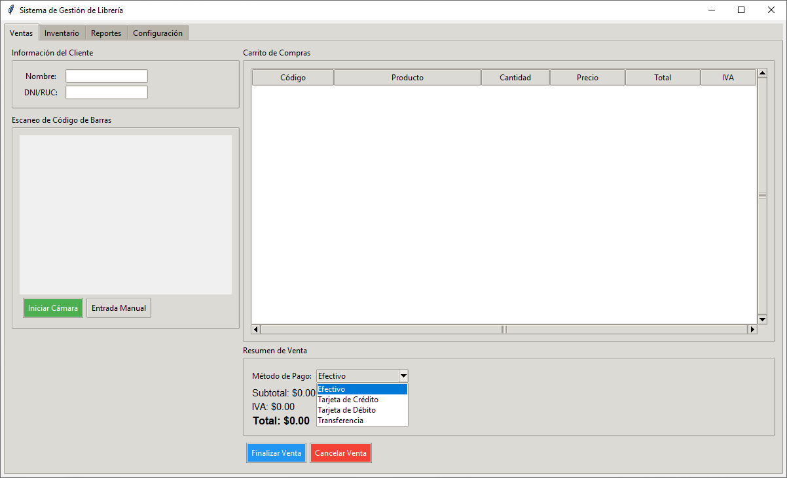
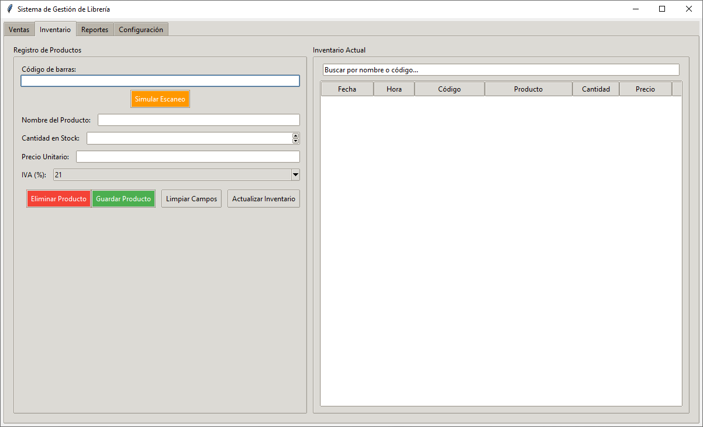
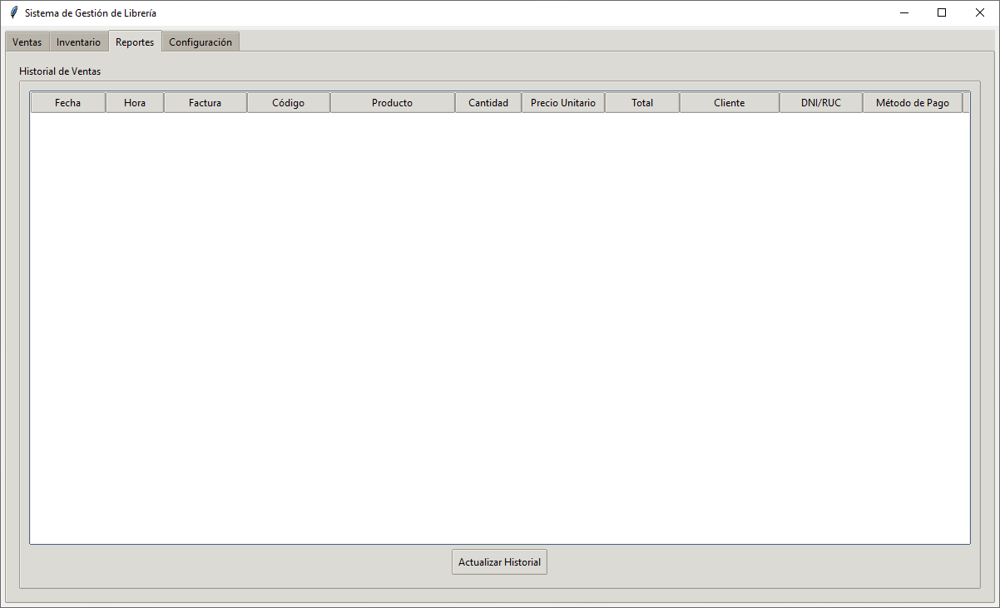
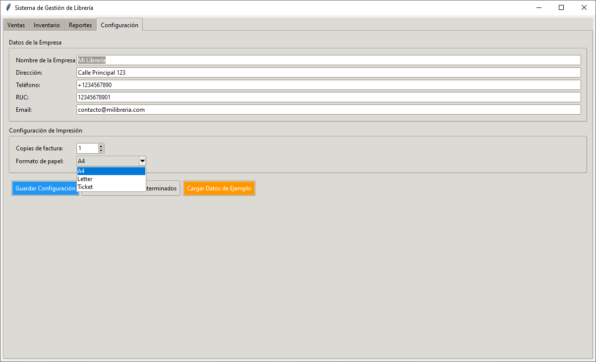
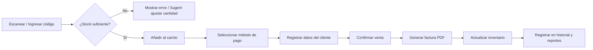

# Sistema de Gestión de Librería

[](https://www.python.org/)
[](#)
[](#)
[](LICENSE)

**Sistema de Gestión de Librería** en **Python** con **Tkinter**. Administra inventario, ventas y facturación en **PDF**, genera **reportes gráficos** y permite escaneo de **códigos de barras** (manual, simulación o **cámara web con OpenCV**). Incluye historial de ventas y personalización de datos de la empresa.

> ℹ️ **Nota sobre versión de Python:** aunque versiones previas del proyecto mencionaban *Python 3.6+*, las dependencias actuales requieren **Python 3.8 o superior**.

---

## Tabla de contenidos

- [Características](#características)
- [Ejemplos visuales](#ejemplos-visuales)
- [Requisitos del sistema](#requisitos-del-sistema)
- [Instalación](#instalación)
  - [Método recomendado (venv)](#método-recomendado-venv)
  - [Instaladores (pueden estar desactualizados)](#instaladores-pueden-estar-desactualizados)
  - [Verificación manual de dependencias](#verificación-manual-de-dependencias)
- [Ejecución](#ejecución)
- [Uso básico](#uso-básico)
- [Estructura del proyecto](#estructura-del-proyecto)
- [Archivos de datos y configuración](#archivos-de-datos-y-configuración)
- [Reportes y exportación](#reportes-y-exportación)
- [Solución de problemas](#solución-de-problemas)
- [Contribuir](#contribuir)
- [Licencia](#licencia)

---

## Características

- **Inventario**
  - Alta/edición/baja de productos (código de barras, nombre, cantidad, precio e IVA).
  - Búsqueda y filtrado en tiempo real.
  - Descuento automático de stock tras ventas y validaciones anti stock negativo.

- **Ventas**
  - Carrito con múltiples productos y cantidades.
  - Escaneo por entrada manual, simulación o **cámara web (OpenCV)**.
  - Cálculo automático de **subtotal, IVA y total**.
  - Registro de cliente (nombre, DNI/RUC) y **método de pago** (efectivo, tarjeta, transferencia).

- **Facturación**
  - Generación de **PDF** con **ReportLab**.
  - Datos de empresa personalizables.
  - Numeración única basada en *timestamp*.
  - Guardado en carpeta `facturas/`.

- **Reportes**
  - Historial completo de ventas.
  - Gráficos (Matplotlib): ventas por día, productos más vendidos, métodos de pago.
  - Exportación a **CSV** y **PDF**.

- **Otros**
  - Interfaz moderna con `ttkthemes`.
  - Sistema de *logging* y carga de datos de ejemplo.

---

## Ejemplos visuales

> Sube tus capturas reales en `docs/screenshots/` y reemplaza estas rutas cuando las tengas.

- Punto de venta / Carrito  
  

- Inventario  
  

- Reportes  
  

- Configuración  
  

**Mockup del flujo de venta (Mermaid):**



---

## Requisitos del sistema

- **Python: 3.8+**
- **SO:** Windows / Linux (macOS no probado)
- **Cámara web** (opcional, para escaneo con OpenCV)
- **Resolución** recomendada: 1280×720 o superior
- Espacio de almacenamiento para CSV, JSON y PDFs

---

## Instalación

### Método recomendado (venv)
```bash
# 1) Clonar el repo
git clone https://github.com/L-L-L-user-userLpz/sistema-gestion-libreria.git
cd sistema-gestion-libreria

# 2) Crear entorno virtual
# Windows
python -m venv .venv
.venv\Scripts\activate

# Linux / macOS
python3 -m venv .venv
source .venv/bin/activate

# 3) Actualizar pip e instalar dependencias
python -m pip install --upgrade pip
pip install -r requirements.txt
```

### Instaladores (pueden estar desactualizados)

- **Windows**
  1. Doble clic en `install.bat`
  2. Espera a que se instalen dependencias
  3. Ejecuta: `python sistema.py`

- **Linux**
  1. Dar permisos: `chmod +x install.sh`
  2. Ejecutar: `./install.sh`
  3. Ejecutar: `python3 sistema.py`

> Si un instalador falla, usa el método recomendado (venv).

### Verificación manual de dependencias
```bash
python check_deps.py
# (Este comprobador puede estar desactualizado; ante dudas revisa requirements.txt)
```

- **Dependencias principales** (ver `requirements.txt`):
  - `ttkthemes>=3.2.2`
  - `reportlab>=3.6.12`
  - `matplotlib>=3.7.1`
  - `opencv-python>=4.8.1`
  - `Pillow>=10.0.0`
  - `numpy>=1.24.3`
  - `schedule>=1.2.0` (no usado actualmente; legado)

---

## Ejecución
```bash
# Dentro del entorno virtual del proyecto
python sistema.py
```

---

## Uso básico

1. **Inventario:** agrega o edita productos (código de barras, nombre, precio, IVA y stock).
2. **Venta:** escanea/inserta el código de barras → añade al carrito → indica cantidad.
3. **Cliente y pago:** completa datos del cliente, elige método de pago.
4. **Finalizar:** confirma la venta → se genera factura PDF → se actualiza el stock.
5. **Reportes:** consulta ventas por fecha, productos más vendidos y métodos de pago; exporta a CSV/PDF.

---

## Estructura del proyecto
```bash
sistema-gestion-libreria/
├── sistema.py                 # Código fuente principal (Tkinter)
├── requirements.txt           # Dependencias del proyecto
├── README.md                  # Este archivo
├── manual_usuario.md          # Manual de usuario (no técnicos + técnico)
├── LICENSE                    # MIT
├── check_deps.py              # Verificación de dependencias (opcional/legado)
├── install.bat                # Instalación Windows (opcional/puede estar desactualizado)
├── install.sh                 # Instalación Linux (opcional/puede estar desactualizado)
├── inventario.csv             # Base de datos de productos
├── ventas.csv                 # Historial de ventas
├── config.json                # Configuración de la aplicación
├── facturas/                  # Facturas PDF generadas
└── docs/
    └── screenshots/           # Capturas de pantalla
```

---

## Archivos de datos y configuración

- `inventario.csv`: listado de productos (código, nombre, precio, IVA, stock).

- `ventas.csv`: registros de ventas (fecha/hora, ítems, totales, cliente, método de pago).

- `config.json`: datos de personalización. **Ejemplo sugerido**:
```json
{
    "company": {
        "company_name": "Librería Ejemplo",
        "address": "Calle Principal 123",
        "phone": "+1234567890",
        "tax_id": "12345678901",
        "email": "contacto@milibreria.com"
    },
    "printing": {
        "copies": "1",
        "paper_format": "A4"
    }
}
```

> Ajusta las claves según lo que soporte tu `sistema.py`.

---

## Reportes y exportación

- **Visualización** de gráficos con Matplotlib.
- **Exportación:**
  - CSV: datos planos de ventas o productos.
  - PDF: reportes y facturas mediante ReportLab.

---

## Solución de problemas

- `tkinter` **no encontrado (Linux/Debian/Ubuntu)**:
```bash
sudo apt-get update
sudo apt-get install -y python3-tk
```

- **Cámara no detectada / Permisos:**
  - Cierra otras apps que usen la cámara.
  - Prueba cambiar `"indice_camara"` en `config.json` (0 → 1).

- **OpenCV falla al abrir cámara en Linux:**
```bash
sudo apt-get install -y v4l-utils
v4l2-ctl --list-devices
```

- **Fuentes o render de PDFs (ReportLab):**
  - Asegúrate de tener fuentes disponibles en el sistema o configura rutas en tu código.

- **Conflictos de dependencias:**
  - Actualiza `pip` y reinstala:
```bash
python -m pip install --upgrade pip
pip install --upgrade --force-reinstall -r requirements.txt
```

---

## Contribuir

1. Haz un fork del proyecto.
2. Crea una rama: `git checkout -b feature/mi-mejora`.
3. Commits descriptivos y pequeños.
4. Pull request con captura/Descripción si afecta a la UI.

  - **Ideas de roadmap:**

    - Backups automáticos programados.
    - Soporte de base de datos (SQLite/PostgreSQL) además de CSV.
    - Soporte multiusuario/roles.
    - Tests automatizados (pytest) y CI.

---

## Licencia

Este proyecto se distribuye bajo la **Licencia MIT**. Consulta el archivo [](LICENSE) para más detalles.
